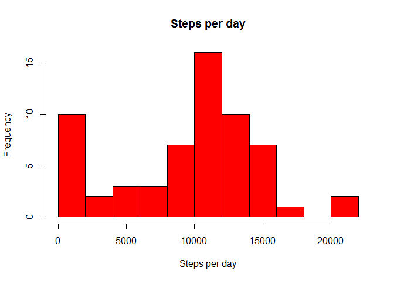
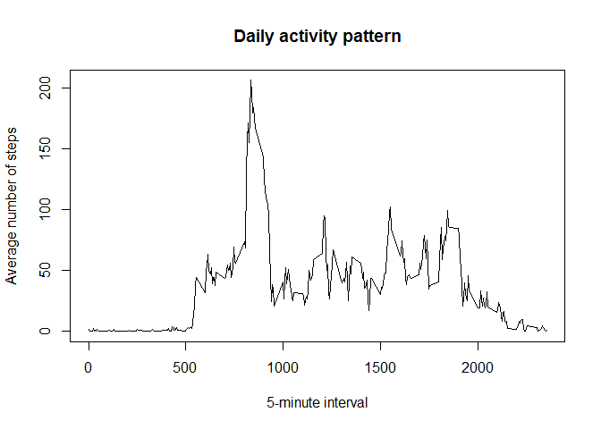
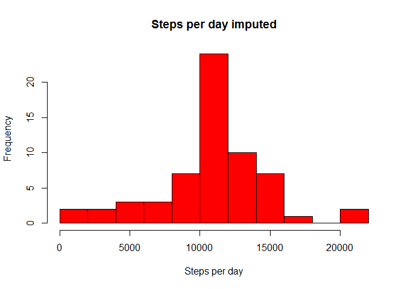
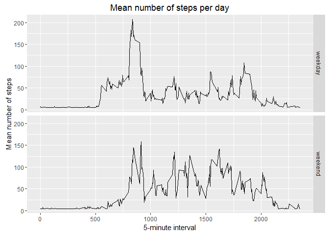

# Reproducible Research: Peer Assessment 1


## Loading and preprocessing the data

```r
if(!file.exists('activity.csv')){
    unzip('activity.zip')
}
activityData <- read.csv('activity.csv')
```


## What is mean total number of steps taken per day?


```r
stepsByDay <- tapply(activityData$steps, activityData$date, sum, na.rm=TRUE)

hist(stepsByDay, breaks = 10, col = "red", main="Steps per day", xlab = "Steps per day" )
```

<!-- -->

```r
stepsByDayMean <- mean(stepsByDay)
stepsByDayMedian <- median(stepsByDay)
```

- Mean number of steps per day: 9354.2295082
- Median of number of steps per day: 10395

## What is the average daily activity pattern?


```r
averageStepsPerTimeBlock <- aggregate(x=list(meanSteps=activityData$steps), by=list(interval=activityData$interval), FUN=mean, na.rm=TRUE)

plot(averageStepsPerTimeBlock$interval,averageStepsPerTimeBlock$meanSteps, type="l", xlab="5-minute interval", ylab="Average number of steps", main = "Daily activity pattern")
```

<!-- -->

```r
mostSteps <- which.max(averageStepsPerTimeBlock$meanSteps)
gsub("([0-9]{1,2})([0-9]{2})", "\\1:\\2", averageStepsPerTimeBlock[mostSteps,'interval'])
```

```
## [1] "8:35"
```

## Imputing missing values


```r
numMissingValues <- length(which(is.na(activityData$steps)))
```

Number of missing values: 2304


```r
activityDataImputed <- activityData
activityDataImputed$steps <- impute(activityData$steps, fun=mean)

stepsByDayImputed <- tapply(activityDataImputed$steps, activityDataImputed$date, sum, na.rm=TRUE)

hist(stepsByDayImputed, breaks = 10, col = "red", main="Steps per day imputed", xlab = "Steps per day" )
```

<!-- -->

```r
stepsByDayImputedMean <- mean(stepsByDayImputed)
stepsByDayIMputedMedian <- median(stepsByDayImputed)

diffstepsMean <- stepsByDayMean - stepsByDayImputedMean
diffstepsMedian <- stepsByDayMedian - stepsByDayIMputedMedian
```

- Mean number of steps per day imputed: 1.0766189\times 10^{4}
- Median of number of steps per day imputed: 1.0766189\times 10^{4}

Difference between original data and imputed data for mean number of steps per day: -1411.959171, for the median: -371.1886792.

## Are there differences in activity patterns between weekdays and weekends?


```r
activityDataImputed$dateType <-  ifelse(as.POSIXlt(activityDataImputed$date)$wday %in% c(0,6), 'weekend', 'weekday')
averagedActivityDataImputed <- aggregate(steps ~ interval + dateType, data=activityDataImputed, mean)

ggplot(averagedActivityDataImputed, aes(interval, steps)) + 
    geom_line() + 
    facet_grid(dateType ~ .) +
    labs(x = "5-minute interval") + labs(y = "Mean number of steps" ) + labs(title = "Mean number of steps per day")
```

<!-- -->
